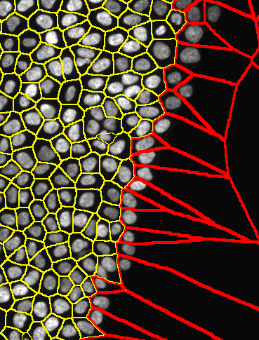
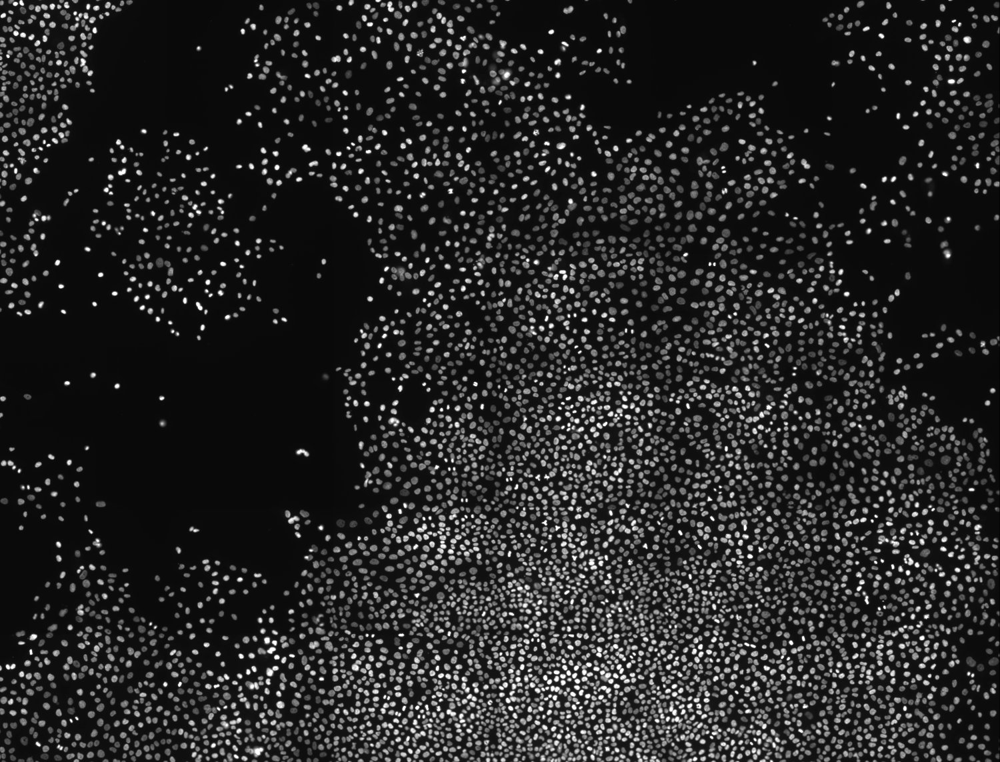
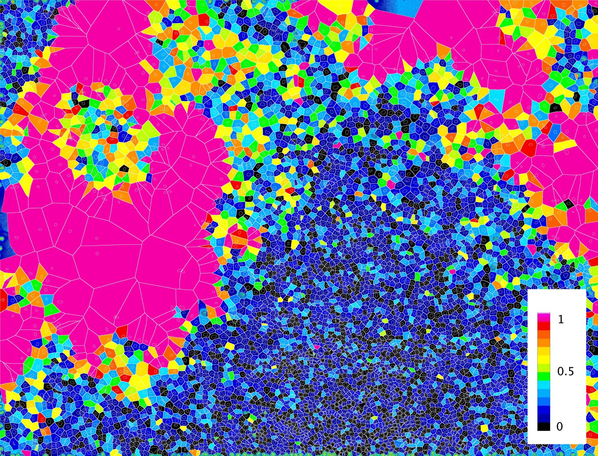
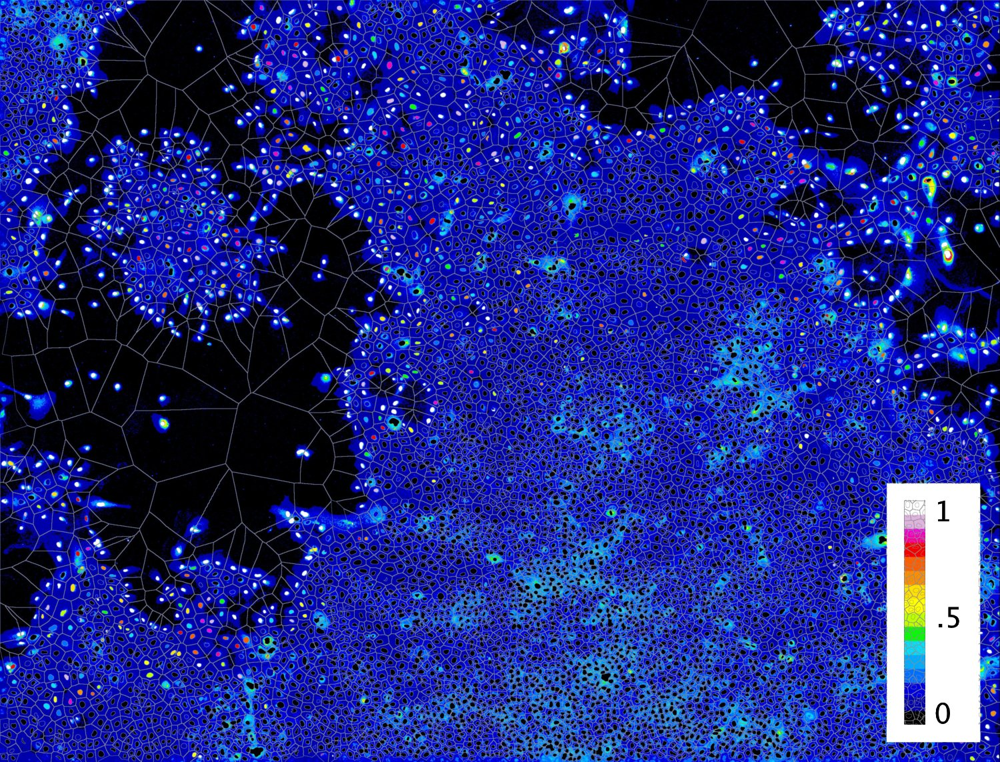
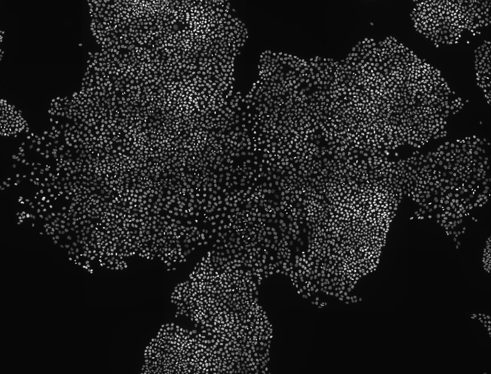
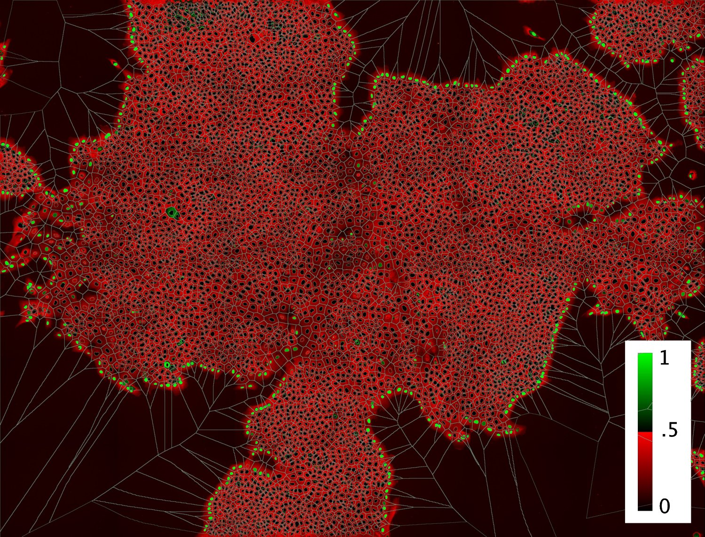

# Classifier: cells at the edges

The goal of this classifier is to identify the cells at the edges of the population. An example of cells (nuclei) located at edges of the monolayer is shown below (marked in red). In this folder you find the "data preparation" (r code), the code for "machine learning classifier" (MATLAB/octave). Find below a description of the Pipline prototype

 

Below I show various images and visualizations of the results from the cross validation performed directly on the image acquisition. The color code indicates the probability of cells to be at the edge of the population. The classifier has an accurancy of 95.4%

 

 

 

 

 

## [Data preparation 1 (show)](https://cdn.rawgit.com/rempic/MACHINE-LEARNING-Edge-Cells-classifier/master/PIPELINE/1_DATA_PREPARATION1.html)

- Clean and Visualize features and relative stats
- Transform features: substitute values and normalization of absolute values
- Shuffle and split the data-set in training and test sets
- Save trainging and test data(cross validation will be performed directly on images)
- r code: PIPELINE/1_DATA_PREPARATION1.rmd

## [Data preparation 2 (show)](https://cdn.rawgit.com/rempic/MACHINE-LEARNING-Edge-Cells-classifier/master/PIPELINE/2_DATA_PREPARATION2_NORM_RESCAL.html)
- Normalize distributions (e.g, log transformation)
- Rescaling features
- Save: transformed data set, mean and stdev of features to be used for testing and cross validation 
- r code: PIPELINE/2_DATA_PREPARATION2_NORM_RESCAL.rmd

In the sub-folder "1_DATA to 3_DATA" find the files with 
  - original data
  - prepared data  
  - shuffle and split data for training and test sets
  - tranformed data (log and rescaling)
  - mean and stdev features from transformed data
  

## [CLASSIFIER: TRAINING](/PIPELINE/)
MATLAB/octave files for the training is:
  - m3_TRAINING.m

functions for cost function, sigmoid and predictor are in:
 - 3_LIB

input data files are in:
 - 2_DATA and 3_DATA

output data files in output are in:
 - 4_DATA

## [CLASSIFIER: TESTING](/PIPELINE/)
MATLAB/octave files for the testing is:
  - m3_TESTING.m

sigmoid and predictor functions are in:
 - 3_LIB

input data files are in:
 - 2_DATA and 3_DATA

output data files in output are in:
 - 4_DATA

## [CLASSIFIER: CROSSVALIDATION](https://cdn.rawgit.com/rempic/MACHINE-LEARNING-Edge-Cells-classifier/master/PIPELINE/4_CROSS_VALIDATION.html)
r code for the cross validation:
  - 4_CROSS_VALIDATION.Rmd

input data files are in:
 - 4_DATA

output data files in output are in:
 - 5_DATA

